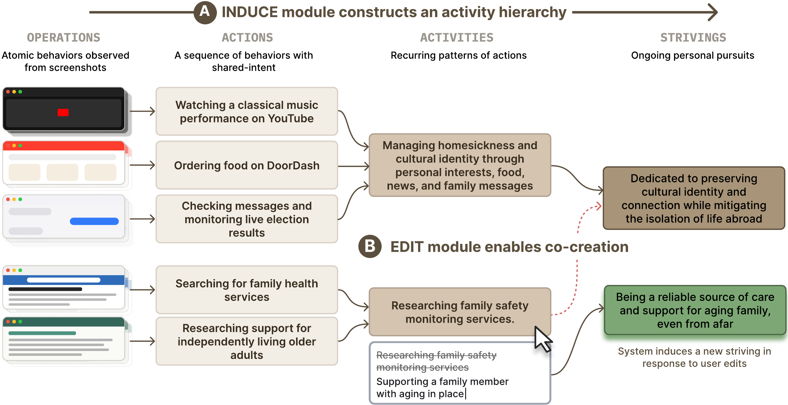
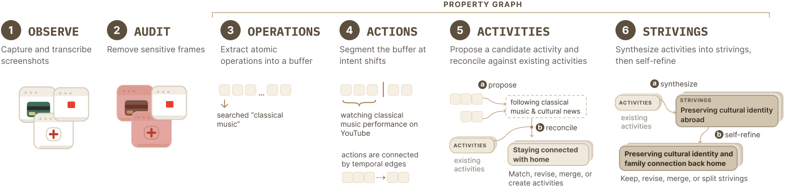
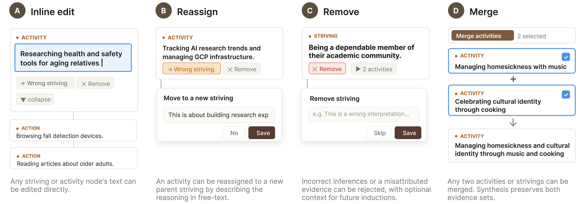

# Tempo

**“What Are You Really Trying to Do?”: Co-Creating Life Goals from Everyday Computer Use**

Shardul Sapkota, Matthew Jörke\*, Zane Sabbagh\*, Omar Shaikh, Grace Wang, and James A. Landay<br>
Stanford University · UIST 2026<br>
\* Equal contribution

[Website](https://stanfordhci.github.io/striving-cocreation/) · [Paper](https://arxiv.org/abs/2605.00497v2) · [Installation](#installation) · [Citation](#citation)

We introduce **striving co-creation**, a process in which a person and a system jointly construct a representation of the long-term goals that person is working toward, drawing on observations of everyday computer use. Grounded in Activity Theory and Emmons’ personal strivings framework, Tempo progressively organizes these observations into a hierarchy of operations, actions, activities, and strivings.

The same action can be driven by many different goals, making strivings difficult to resolve from observation alone. Tempo therefore combines inference with an editing interface: people can inspect the evidence behind an inference and reshape how the system understands them. Their corrections inform subsequent rounds of induction.



## System

Tempo consists of two modules: **Induce**, which constructs the hierarchy from screen observations and user-provided context, and **Edit**, which allows people to revise it.

### Induce

The observer captures screenshots during computer use. A vision-language model transcribes the observations, and a sequence of inference stages constructs four levels of representation:

| Level | Definition |
|---|---|
| **Operations** | Atomic behavioral interactions, such as a click, a scroll, or a keystroke. |
| **Actions** | Goal-directed sequences composed from contiguous operations. |
| **Activities** | Recurring patterns of actions that share a common motive, broader than a single task but narrower than a life domain. |
| **Strivings** | Ongoing pursuits that organize multiple activities and persist beyond any single project. |

Action boundaries follow shifts in intent. Activities are proposed and reconciled across observations; strivings are then synthesized and refined. The resulting hierarchy is stored as a property graph, where each node carries a natural-language description and structured metadata. An action can contribute to multiple activities, and an activity can support multiple strivings.

The **About you** questionnaire elicits context about a person's roles, routines, circumstances, and priorities. These answers condition screenshot transcription and each stage of inference without requiring the person to articulate their goals in advance. The current implementation also permits recording without completing the questionnaire.



The implementation includes app and domain exclusions, a local OCR filter, and a model-based contextual integrity audit. Their ordering and limitations are described under [Privacy and data](#privacy-and-data).

### Edit

The editing interface lets people trace a striving through the activities, actions, and observations that support it. They can rewrite descriptions, reassign activities, remove inferences, or merge related items. Corrections persist as constraints on subsequent induction cycles.

In the current interface, **Hierarchy** opens in a card view. Users mark changes and compile them into a proposed revision, review the result, and choose whether to keep it. A table view provides a separate tab for each level of the hierarchy. **Graph** displays relationships between entities, while **Search** supports full-text retrieval and a timeline of observations.



The inference pipeline is implemented in Python, with a local SQLite database for entities and relations. The React interface runs in a browser or an Electron desktop shell. In the code and API, striving entities are named `goal`.

## Evaluation

We ran a week-long study with 14 participants. Participants recognized the inferred strivings as representative of their long-term goals. Our ablation results show that user-provided context improves the quality of individual strivings, while hierarchical structure improves the representativeness of the overall set. The hierarchy also supports editing by allowing participants to trace how the system arrived at an inference and revise it.

These findings concern the quality and editability of the inferred representations. Longer deployments are needed to understand how those representations change over time. The [paper](https://arxiv.org/abs/2605.00497v2) reports the study design, comparisons, and limitations.

## Installation

Tempo is a research prototype installed from source. The supported capture platform is macOS; Python 3.12 or newer and a configured model provider are required.

### Run from source

```bash
git clone https://github.com/StanfordHCI/striving-cocreation.git
cd striving-cocreation
cp .env.default .env
```

Configure one provider in `.env` using the examples below, then launch Tempo:

```bash
./run.sh
```

The script installs `uv`, Node, and `pnpm` if needed, installs the project dependencies, loads `.env`, and opens the Electron development app. In **Record**, check capture permissions and exclusions before starting a recording. macOS requires Screen & System Audio Recording and Accessibility permissions for the application responsible for launching Tempo.

### Model configuration

The default provider is Gemini. To use it with an API key:

```bash
MODEL_NAME="gemini-3.8-flash"
GOOGLE_API_KEY="your-google-api-key"
```

For Vertex AI Express Mode:

```bash
MODEL_NAME="gemini-3.8-flash"
GEMINI_VERTEXAI_EXPRESS=true
VERTEX_EXPRESS_API_KEY="your-vertex-express-api-key"
```

For OpenAI:

```bash
MODEL_NAME="gpt-4o-mini"
OPENAI_API_KEY="your-openai-api-key"
```

For Anthropic:

```bash
MODEL_NAME="claude-sonnet-4-5"
ANTHROPIC_API_KEY="your-anthropic-api-key"
```

For a local or hosted OpenAI-compatible endpoint:

```bash
MODEL_NAME="Qwen/Qwen2-VL-7B-Instruct"
TEMPO_LM_API_BASE="http://localhost:8000/v1"
# TEMPO_LM_API_KEY="your-endpoint-key"  # If authentication is required.
```

Standard Vertex AI with a service account or Application Default Credentials is also supported; `.env.default` contains that configuration. Enable only one Vertex mode: Express Mode uses `GEMINI_VERTEXAI_EXPRESS`, while standard Vertex uses `GEMINI_VERTEXAI`. Compatible endpoints must implement the OpenAI chat-completions interface.

The `.env` file is ignored by Git. Keep credentials out of tracked files.

### Browser interface

After installing the source dependencies, the interface can also be built and installed as part of the Python package. This requires `pipx`:

```bash
PYTHON=.venv/bin/python ./scripts/build-wheel.sh
pipx install dist/tempo_ai-0.1.0-py3-none-any.whl
```

Run `tempo start` from the installed package to start recording and open the interface at `http://127.0.0.1:8756`. Run `tempo serve` to browse existing data without recording. The browser and Electron interfaces use the same backend.

### Platform support

| Platform | Status |
|---|---|
| macOS | Supported capture platform and primary test target. |
| Linux / GNOME | Experimental capture support through the included GNOME extension; not covered by CI. |
| Windows | Query access to an existing database through the Python API; no capture backend. |

## Contextual assistant

The current implementation includes an assistant that uses the behavioral graph to suggest next steps and support conversations about a person's goals. It is an application of the representation described in the paper and was not evaluated in the field study.

Open **Assistant** and select **Enable assistant**. It uses the model provider configured for inference; the interface displays the model and destination before enabling it. Context includes onboarding answers, recent operations, actions and activities, saved goals, and relevant graph relationships. Chat also includes the conversation history. Assistant requests do not include screenshots.

Suggestions are prepared in the background. **Goals in focus** shows the prepared steps associated with a selected goal. Up to three suggestions are shown, each with supporting evidence and a model-assessed confidence of at least 8/10. This score is not a calibrated probability. Suggestions expire after at most 30 minutes and are invalidated when their context changes. Completion and dismissal feedback are stored locally to reduce repetition.

**Prepare in chat** produces a draft or plan that can be revised through conversation. **New chat**, **Talk this through**, and **Discuss with assistant** also open conversations. Threads are saved locally under `assistant/chats/` in the data directory and can be resumed after restarting. The assistant does not send messages or carry out actions in other applications.

**Pause assistant** stops new assistant requests while leaving recording unchanged. Enabling is remembered for the configured destination; a change to the model configuration requires enabling it again.

## Privacy and data

Screenshots, transcriptions, inferred entities, settings, and chat history are stored under `~/.cache/tempo` by default. Set `TEMPO_DATA_DIR` to use another location. Retained data does not expire automatically. The browser interface communicates with a local loopback server; inference sends screenshots and textual context to the configured model endpoint. API keys are not returned by the browser configuration API.

Recording can be paused, and app and browser-domain exclusions allow users to exclude selected contexts from capture. Automated filtering has the following limits in the current implementation:

- **Local OCR filter.** Screenshots are saved as JPEGs before filtering. When enabled, OCR checks only the last frame of each batch for patterns associated with secrets and personally identifiable information. A match blocks model transcription and triggers an attempt to delete the batch's JPEGs. Deletion failures are ignored, and warning logs include up to 40 characters of the matched text, so rejected content may remain on disk or in logs. Earlier frames are not checked individually. If OCR is unavailable, fails, or returns no text, capture proceeds without this check.
- **Contextual integrity audit.** A separate model-based audit evaluates the transcription before operation extraction. It runs after screenshot transcription, so it does not prevent the initial transmission to the transcription provider.

To inspect the configured destinations and local data location:

```bash
tempo doctor
tempo data-dir
```

After stopping recording, remove screenshots or all local data with the following commands. Each asks for confirmation:

```bash
tempo purge --screenshots
tempo purge --all
```

## Troubleshooting

**Recording starts but no screenshots appear.** Check the status message in **Record**, then try moving or clicking in another application. Capture is driven by mouse activity; an idle screen, an excluded application, or a sleeping display can pause it. A running observer does not by itself confirm that screenshots are being captured.

On macOS, use **Check capture permissions** and verify the relevant application under **System Settings → Privacy & Security**. When launching from a terminal, permissions generally belong to the terminal application or the editor that owns its integrated terminal. Quit and relaunch the responsible application after changing permissions.

The observer diagnostics distinguish capture, filtering, and transcription problems:

```bash
curl -s http://127.0.0.1:8756/api/diagnostics/observer | python3 -m json.tool
```

If `blocked_by_content_filter` increases, check whether a configuration file or other sensitive content is visible. Placeholder API keys can also match the filter. Close the file or exclude the application from capture.

**Model requests fail with a quota error.** Check the selected model and the provider's quota. Review `MODEL_NAME` in `.env` and any exported shell settings; `run.sh` loads `.env` on each launch. A `429 RESOURCE_EXHAUSTED` response does not by itself identify the cause of the quota failure.

## Command-line and Python interfaces

For commands run from a source checkout, first activate the environment with `source .venv/bin/activate`.

```bash
tempo start                                  # Record, infer, and open the UI
tempo start --no-ui                          # Record without opening a browser
tempo start --model gpt-4o                   # Select another model
tempo start --ignore-app "Finder,Spotlight"  # Exclude apps for this recording
tempo serve                                  # Browse existing data
tempo query "debugging" --limit 20           # Search the hierarchy
tempo timeline --days 7
tempo stats
```

The Python API provides access to the same local graph. Entity IDs in this example should be replaced with IDs from the recorded data:

```python
import tempo

t = tempo.Tempo()
t.goals()
t.hierarchy(goal_id=3)
t.search("debugging", limit=20)
t.timeline(days=7)
t.trace_up(entity_id=42)
t.trace_down(entity_id=3)
```

## Citation

```bibtex
@inproceedings{sapkota2026tempo,
  author = {Sapkota, Shardul and J{\"o}rke, Matthew and Sabbagh, Zane and
            Shaikh, Omar and Wang, Grace and Landay, James A.},
  title = {``What Are You Really Trying to Do?'':
           Co-Creating Life Goals from Everyday Computer Use},
  booktitle = {The 39th Annual ACM Symposium on
               User Interface Software and Technology},
  year = {2026},
  publisher = {Association for Computing Machinery},
  address = {New York, NY, USA},
  location = {Detroit, MI, USA},
  numpages = {20},
  doi = {10.1145/3830398.3830630},
  url = {https://doi.org/10.1145/3830398.3830630},
  series = {UIST '26}
}
```

## Contact

For questions about the research or implementation, contact [Shardul Sapkota](mailto:sapkota@stanford.edu) or [open an issue](https://github.com/StanfordHCI/striving-cocreation/issues).

## Acknowledgments

Tempo incorporates code adapted from [GUM (General User Models)](https://github.com/GeneralUserModels/gum).

## License

The software source code is released under the [MIT License](LICENSE). The paper and paper-derived figures in `docs/public/figures/` are released under the [Creative Commons Attribution 4.0 International License](https://creativecommons.org/licenses/by/4.0/). See [LICENSE-CONTENT.md](LICENSE-CONTENT.md) for attribution and scope.
